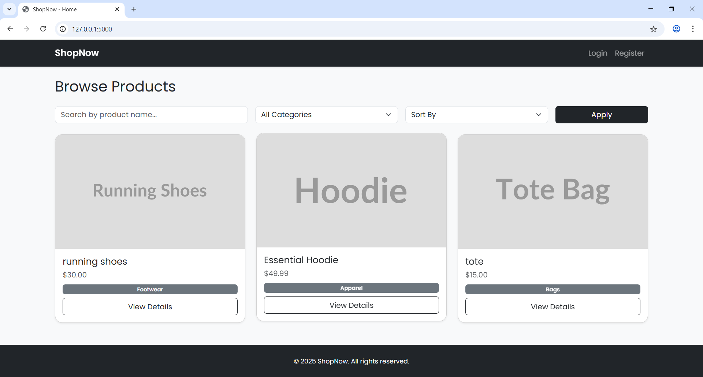
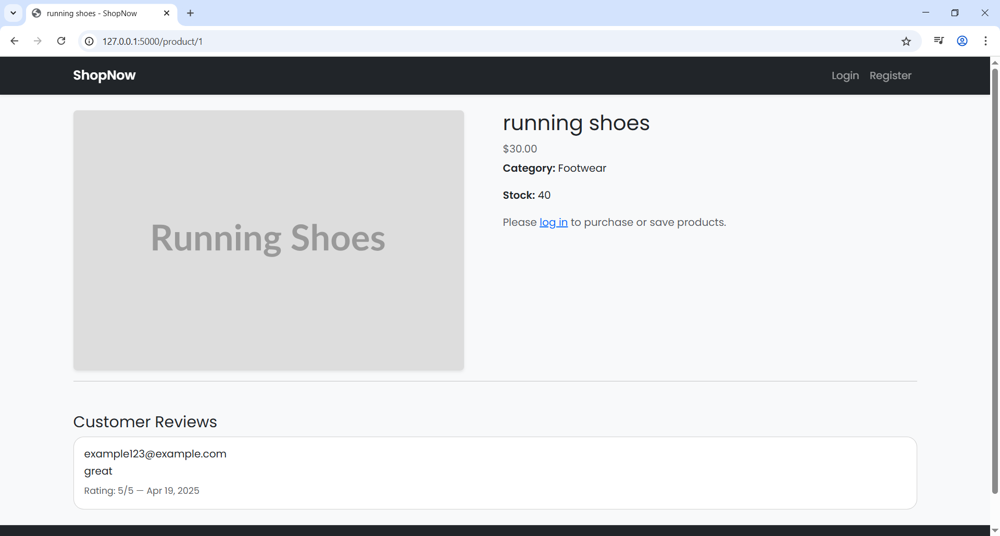
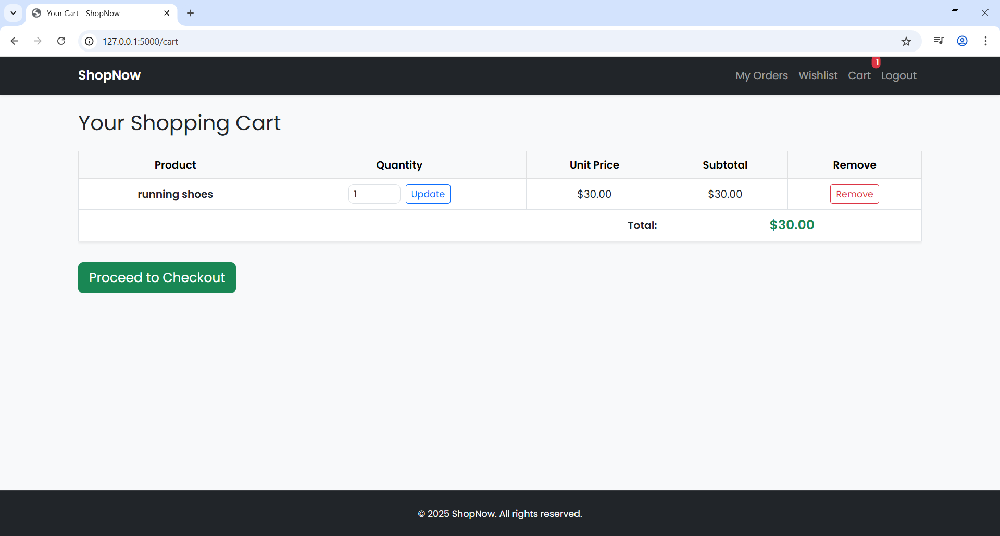
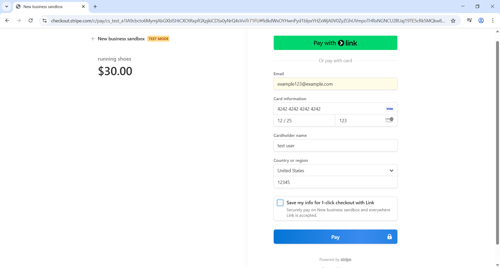
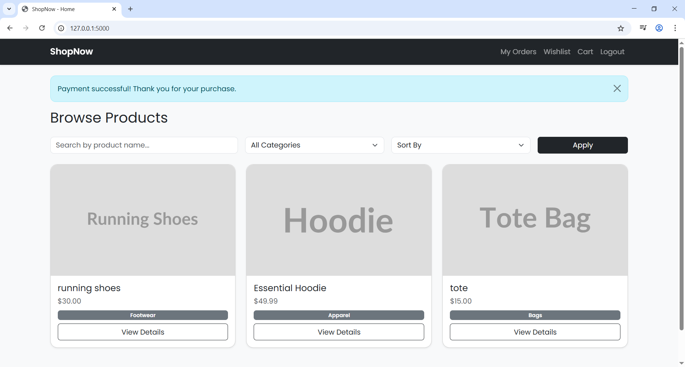
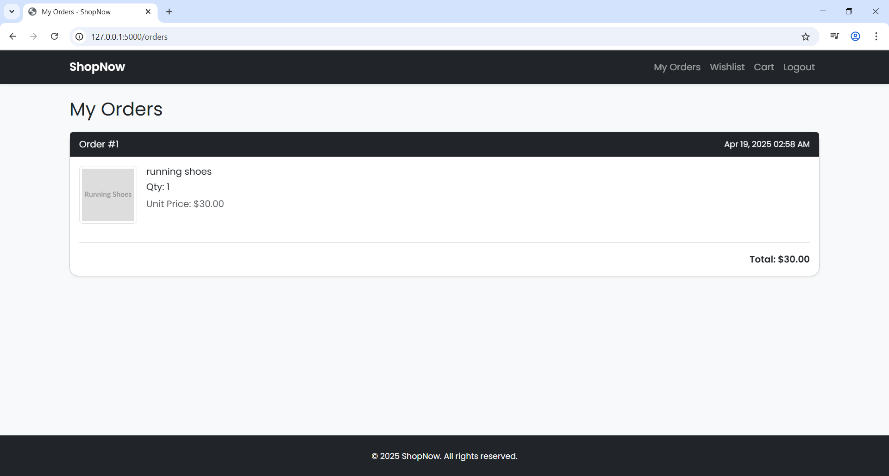
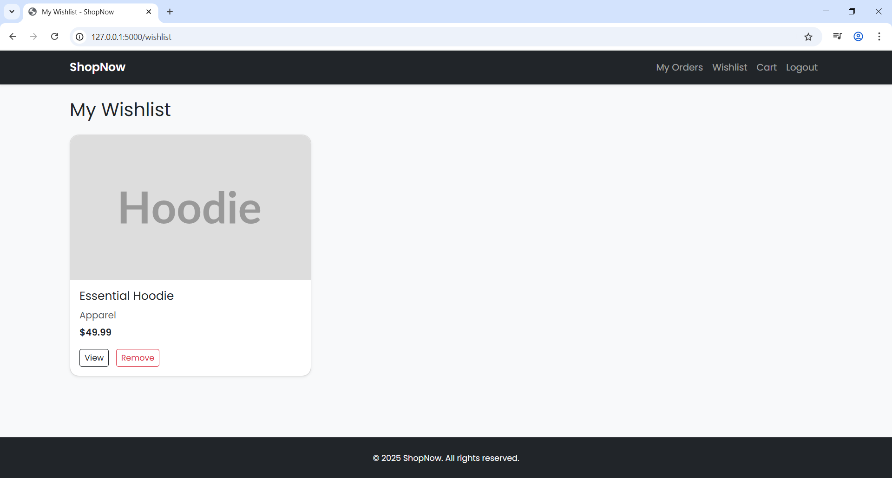

# 🛍️ Flask E-Commerce Web App – ShopNow

A professional full-stack e-commerce platform built with Flask, designed for learning and portfolio use. Features include Stripe checkout, user authentication, cart management, wishlist, admin panel, and order history.

---

## 🧾 Overview

**ShopNow** is a full-featured online shopping platform built using Flask. It supports browsing products, managing a cart and wishlist, secure checkout via Stripe, and includes a role-protected admin panel for managing inventory. Built as a portfolio project to demonstrate end-to-end web app development.

---

## 📸 Screenshots

### Homepage  


### Product Detail  


### Cart  


### Stripe Checkout  


### Checkout Success  


### Order History  


### Wishlist  


---

## ✨ Features

- 🔐 User registration, login, logout
- 👤 Profile editing (address and preferences)
- 🛍️ Product catalog with search, filter, and sort
- 🛒 Add to cart, update quantity, remove items
- 💳 Stripe Checkout integration
- 📦 Order history with timestamp and totals
- ❤️ Wishlist with add/remove
- 💬 Product reviews with rating
- 🛠️ Admin panel to add, edit, and delete products
- 🔒 Role-based route protection

---

## 🛠️ Tech Stack

- **Backend**: Flask, Flask-SQLAlchemy, Flask-WTF, Flask-Login, Flask-Migrate
- **Frontend**: Jinja2 Templates, Bootstrap 5, HTML/CSS
- **Payments**: Stripe API (Test Mode)
- **Database**: SQLite (via SQLAlchemy)
- **Auth**: Session-based using Flask-Login
- **Environment**: Python-dotenv

---

## 📚 What I Learned

- Structuring Flask apps with blueprints and application factory
- Building secure user authentication flows
- Integrating Stripe Checkout API with Flask
- Managing cart, orders, and wishlist logic in a real-world app
- Building admin CRUD panels with form validation
- Writing modular, maintainable, and production-style Python

---

## 📁 Project Structure

```
ecommerce_web_app/
│
├── app/
│   ├── __init__.py
│   ├── models.py
│   ├── routes.py
│   ├── forms.py
│   ├── context_processors.py
│   ├── templates/
│   └── static/
│
├── media/
│   └── screenshots/
│
├── .env.example
├── config.py
├── run.py
├── requirements.txt
└── README.md
```

---

## 🚀 How to Run Locally

1. **Clone the repo**  
```bash
git clone https://github.com/your-username/ecommerce-web-app.git
cd ecommerce-web-app
```

2. **Create a virtual environment**  
```bash
python -m venv venv
source venv/bin/activate  # On Windows: venv\Scripts\activate
```

3. **Install dependencies**  
```bash
pip install -r requirements.txt
```

4. **Create your `.env` file**  
Rename `.env.example` to `.env` and fill in your values.

5. **Run the app**  
```bash
python run.py
```

---

## 🔑 Environment Variables

Your `.env` file should look like this:

```env
SECRET_KEY=your_secret_key_here
DATABASE_URL=sqlite:///instance/ecommerce.db

STRIPE_PUBLIC_KEY=your_test_public_key_here
STRIPE_SECRET_KEY=your_test_secret_key_here
```

You can use [Stripe's test keys](https://stripe.com/docs/testing#international-cards) to simulate payments.

---

## 🔮 Future Improvements

- ✉️ Email confirmation and password reset
- 📊 Admin analytics dashboard (sales, orders, etc.)
- 🌄 Product image uploads with Cloudinary or local storage
- 🧾 PDF invoice export on order confirmation
- 🔍 AJAX search or live filtering

---
